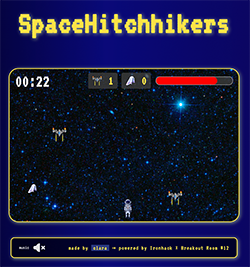

# SpaceHitchhikers

**SpaceHitchhikers — the game: you are a human traveling through space, catch your towel and survive for 4’ 20”**

## Description
You are the ultimate space hitchhiker. Dodge and blast spaceships trying to take you out while grabbing as many towels as you can. Survive for 4’20” and show off your hitchhiking skills. Use your towels for special powers and shoot down your enemies!

🗒️ **Description**

SpaceHitchhikers is an exciting game where you control the hitchhiker, who must survive in space by destroying spaceships and collecting towels. The goal is to survive for 4'20" seconds" while catching as many towels as possible. The game ends when time runs out or the hitchhiker takes too much damage.

🔧 **Main Functionalities**

- **Movement:**
  - Move the hitchhiker with the arrow keys or WASD.
  - Shoot bullets with the 'K' key after collecting 42 towels.

- **Enemies:**
  - Spaceships appear randomly and move downward.
  - Spaceships cause damage to the hitchhiker if he is not immune.

- **Towels and Power-Ups:**
  - Towels appear on the screen and increase the score.
  - Collecting a towel also activates temporary immunity.
  - After collecting 42 towels, the player gains the ability to shoot bullets.

- **Background and Visual Effects:**
  - Space-themed background with an appealing design.
  - Explosion effects and visual changes when the hitchhiker or spaceships are destroyed.

- **Scoring:**
  - The score is calculated based on the number of towels collected, spaceships destroyed, and time survived.

- **Music and Settings:**
  - Music can be toggled on or off with icons on the screen.
  - Volume settings available.

- **Local Storage:**
  - Best scores are saved and displayed at the end of the game.

🛠️ **Backlog Functionalities**

- Add additional shooting mechanics.
- Introduce special power-ups for the player.
- Increase difficulty as time progresses.
- Improve the user interface for a smoother player experience.

🖥️ **Technologies Used**

- HTML
- CSS
- JavaScript
- DOM Manipulation
- JS Classes
- Local Storage
- JS Audio()

🚦 **States**

- **Start Screen:** Initial screen with the button to start the game.
- **Game Screen:** Main game screen with game elements and interface.
- **Game Over Screen:** End-of-game screen showing the score and option to play again.
- **Win Screen:** Victory screen displaying the final score and restart options.

## Extra Links

- [GitHub Repository](https://github.com/clasei/space-hitchhikers)
- [Figma Roadmap](https://www.figma.com/board/QfTyBGvuidg1zGxI70P5Z8/SpaceHitchhikers-%E2%80%94-the-game?node-id=0-1&node-type=canvas&t=5vB5gSxQgMRxNVC4-0)
- [Live Demo](https://clasei.github.io/space-hitchhikers/) 🕹 **Play the Game!**

---

### Special Thanks

Big shoutout to 🐈 Lira for making everything more enjoyable, and to 🎯 Breakout Room 12 for making the process a spacial breeze!